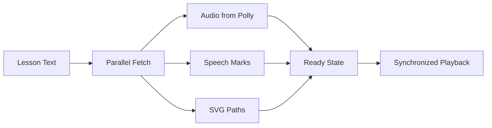

# Meet2AI - AI-Powered 1-on-1 Tutoring Platform

## 🏆 Hackathon Winner Material

**Meet2AI** is an innovative AI tutoring platform that makes learning feel like a real video call with a human tutor. It combines synchronized audio narration with realistic handwriting animation to create an immersive learning experience.

### 🚀 What Makes This a Hackathon Winner?

1. **Realistic Human-Like Experience** - Watch handwriting appear stroke-by-stroke as the AI tutor speaks
2. **Perfect Audio-Visual Sync** - No lag between what you hear and what you see
3. **Familiar Google Meet Interface** - Users feel instantly comfortable
4. **Safe Code Practice Environment** - Execute code in isolated AWS Lambda sandbox
5. **One-Click AWS Deployment** - Automated infrastructure setup

## 🎯 The Problem

Traditional online learning platforms feel robotic and disconnected. Students struggle with:
- **Unnatural AI voices** that don't match visual content
- **Static text displays** instead of dynamic writing
- **No coding practice** in safe environments
- **Complex setup** requiring manual AWS configuration

## 📊 How We Compare

| Feature | Meet2AI | Traditional Platforms | Video Calls | Chatbots |
|---------|---------|----------------------|-------------|----------|
| **Audio-Visual Sync** | ✅ Perfect sync (<50ms) | ❌ No sync | ✅ Manual sync | ❌ Text only |
| **Handwriting Animation** | ✅ Realistic stroke-by-stroke | ❌ Static text/images | ✅ Human writing | ❌ Text only |
| **Code Execution** | ✅ Safe sandbox (AWS Lambda) | ❌ No execution | ❌ No execution | ⚠️ Limited execution |
| **Interface** | ✅ Google Meet familiar UI | ⚠️ Custom learning UI | ✅ Video call UI | ❌ Chat interface |
| **Setup Time** | ✅ 5 minutes (auto AWS) | ⚠️ 30+ minutes | ✅ Instant | ✅ Instant |
| **Learning Engagement** | ✅ Active, interactive | ❌ Passive watching | ✅ Interactive | ⚠️ Text-based |
| **Progress Tracking** | ✅ Automatic (DynamoDB) | ⚠️ Manual/limited | ❌ No tracking | ⚠️ Basic tracking |
| **Mobile Support** | ✅ Full responsive | ⚠️ Limited mobile | ✅ Mobile apps | ✅ Mobile apps |
| **Cost to Scale** | ✅ Serverless (pay-per-use) | ⚠️ Fixed infrastructure | ⚠️ Human tutors | ✅ AI scalable |

## 💡 Our Solution

Meet2AI creates the illusion of a human tutor writing on a whiteboard while explaining concepts. The handwriting appears stroke-by-stroke, perfectly synchronized with the AI's voice narration.

### ✨ Key Features

**🎤 Realistic Handwriting Animation**
- Single-line stroke animation using Hershey fonts
- Human-like jitter and speed variations
- Stroke-by-stroke appearance as words are spoken

**🎯 Perfect Audio-Visual Synchronization**
- Pre-fetch buffering architecture eliminates latency
- Frame-perfect sync between audio and animation
- Uses Amazon Polly speech marks for precise timing

**💻 Safe Code Practice Environment**
- Monaco Editor with Python support
- Isolated AWS Lambda execution (5-second timeout)
- Standard library only - no security risks

**⚡ One-Click AWS Deployment**
- Automated CLI tool detects AWS profiles
- Creates Lambda functions, DynamoDB tables, Polly config
- Generates complete `.env.local` file

**📱 Familiar Google Meet Interface**
- Bottom control bar with mute, video, hand raise
- Split view with whiteboard and webcam feed
- Collapsible sidebar for syllabus and chat

## 🏗️ Technical Architecture

### Frontend
- **Next.js 14** with App Router
- **TypeScript** for type safety
- **Tailwind CSS** for responsive design
- **Fabric.js** for canvas rendering
- **Monaco Editor** for code editing

### Backend Services
- **AWS Lambda** for code execution sandbox
- **Amazon Polly** for neural text-to-speech
- **DynamoDB** for syllabus and progress tracking
- **Next.js API Routes** for backend communication

### Core Innovation: Pre-Fetch Buffering



## 🚀 Getting Started

### Prerequisites
- Node.js 18+
- AWS CLI configured
- AWS account with Polly, Lambda, DynamoDB access

### Quick Start

1. **Clone and install**
```bash
git clone [your-repo-url]
cd meet2ai
npm install
```

2. **Setup AWS infrastructure**
```bash
npm run setup-aws
# Follow prompts to select AWS profile
```

3. **Run the application**
```bash
npm run dev
```

4. **Open in browser**
```
http://localhost:3000
```

## 📁 Project Structure

```
meet2ai/
├── app/                    # Next.js app router pages
│   ├── api/               # API routes for Polly, Lambda
│   ├── session/           # Main tutoring session page
│   └── page.tsx           # Home page with lesson selection
├── components/            # React components
│   ├── ControlBar.tsx     # Google Meet-style controls
│   ├── WhiteboardCanvas.tsx # Handwriting animation canvas
│   ├── WebcamFeed.tsx     # User webcam display
│   └── PracticeMode.tsx   # Code editor with execution
├── lib/                   # Core business logic
│   ├── handwriting-engine.ts # Text to SVG conversion
│   ├── buffering-manager.ts # Audio-visual sync
│   ├── sync-controller.ts # Playback coordination
│   └── lesson-controller.ts # Lesson delivery
├── lambda/                # AWS Lambda code sandbox
│   └── handler.py         # Python code execution
├── scripts/               # Infrastructure scripts
│   └── setup-aws.js       # One-click AWS deployment
└── __tests__/            # Comprehensive test suite
```

## 🧪 Testing

We use both unit tests and property-based tests to ensure correctness:

```bash
# Run all tests
npm test

# Run property-based tests
npm run test:pbt

# Run specific test suites
npm run test:handwriting
npm run test:sync
npm run test:lambda
```

### Property-Based Testing
We validate universal correctness properties with 100+ random inputs:
- **Text to SVG conversion** always produces valid paths
- **Jitter application** stays within 0.5-1px bounds
- **Audio-visual sync** accuracy within 50ms
- **State transitions** follow Loading→Ready→Action order

## 🔧 Configuration

### Environment Variables
The setup script generates `.env.local` with:
```env
AWS_REGION=us-east-1
AWS_PROFILE=your-profile
LAMBDA_CODE_EXECUTOR_ARN=arn:aws:lambda:...
DYNAMODB_SYLLABUS_TABLE=meet2ai-syllabus
POLLY_VOICE_ID=Joanna
POLLY_ENGINE=neural
```

### AWS Services Required
- **Amazon Polly** (neural voices)
- **AWS Lambda** (128MB, 5s timeout)
- **DynamoDB** (PAY_PER_REQUEST)
- **IAM roles** with appropriate permissions

## 🎨 User Experience

### Session Flow
1. **Select a lesson** from the syllabus
2. **Enter session** with Google Meet-like interface
3. **Watch and listen** as AI tutor writes and explains
4. **Practice coding** in the integrated editor
5. **Track progress** across lessons

### Interface Components
- **Whiteboard Panel**: Handwriting animation area
- **Webcam Panel**: Your video feed (optional)
- **Control Bar**: Mute, video, hand raise, end call
- **Sidebar**: Syllabus navigation and chat
- **Practice Mode**: Full-screen code editor

## 📊 Performance Metrics

- **Audio-visual sync**: < 50ms accuracy
- **UI responsiveness**: < 100ms state updates
- **Code execution**: 5-second timeout
- **Asset loading**: Parallel fetch with retry
- **Mobile support**: Responsive down to 320px

## 🔒 Security

- **Code sandbox**: Isolated Lambda execution
- **No internet access**: During code execution
- **Standard library only**: No external imports
- **Timeout enforcement**: 5-second execution limit
- **Memory limits**: 128MB per execution

## 🚀 Deployment

### AWS Setup
```bash
# Run the automated setup
node scripts/setup-aws.js

# Or manually with environment variables
AWS_PROFILE=your-profile npm run setup-aws
```

### Production Build
```bash
npm run build
npm start
```

## 📈 Future Enhancements

1. **Multi-language support** for code execution
2. **Collaborative whiteboard** for group sessions
3. **AI-powered code review** and suggestions
4. **Gamification** with badges and achievements
5. **Mobile app** with offline support

## 🏆 Supported By

### Core Team

#### 👤 Team Lead
**Role:** Full Stack Developer

[GitHub Profile](https://github.com/example) | 

**Contributions:**
- Architecture
- Core Engine
- AWS Integration

---

#### 👤 UI/UX Designer
**Role:** Frontend Developer

[GitHub Profile](https://github.com/example2) | 

**Contributions:**
- UI Components
- Responsive Design
- User Testing

---

#### 👤 Backend Specialist
**Role:** DevOps Engineer

[GitHub Profile](https://github.com/example3) | 

**Contributions:**
- Lambda Functions
- Database Design
- Security

---


### Technology Partners
- **Amazon Web Services** - Polly, Lambda, DynamoDB
- **Vercel** - Next.js hosting and deployment
- **Microsoft** - Monaco Editor (VS Code technology)
- **Open Source Community** - Hershey Fonts, Fabric.js, Tailwind CSS

### Special Thanks
- **Hershey Fonts** for single-line stroke fonts
- **Amazon Polly** for high-quality neural TTS
- **Next.js team** for the amazing framework
- **Fabric.js** for canvas manipulation
- **All hackathon organizers and judges**

### 🛠️ Updating Contributor Information

To update the contributor section with real team data:

```bash
# Show example contributor data
npm run contributors:update

# Clear contributor data
npm run contributors:clear

# Get help with the contributor system
npm run contributors:help
```

**For Hackathon Judges:** This system can be integrated with:
- GitHub API for automatic contributor tracking
- Hackathon registration platforms
- Team management systems
- Real-time collaboration tools

---

**Made with ❤️ for hackathons everywhere**

*Transform learning from passive watching to active experiencing*
